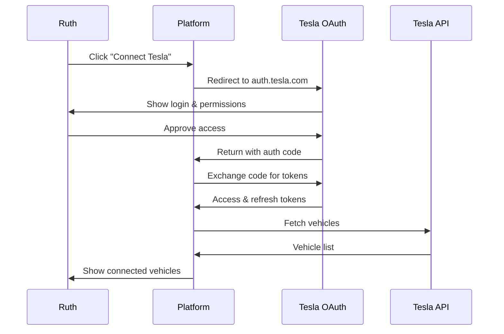

# Tesla Authorization Flow for Ruth's Demo

## Quick Start - Ruth's Tesla Connection

### Step 1: Login to Platform
1. Navigate to: **https://161.35.176.111**
2. Login with credentials:
   - Email: `ruth.tesla@driveway-hub.com`
   - Password: `Demo2024!`

### Step 2: Connect Your Tesla
1. After login, click **"Connect Tesla Vehicle"** button
2. You'll be redirected to Tesla's official OAuth page
3. Login with your Tesla account credentials
4. Review the permissions requested:
   - User Information
   - Vehicle Data Access
   - Vehicle Commands (for navigation)
   - Charging Commands
5. Click **"Authorize"** to grant access

### Step 3: Verify Connection
Once authorized, you'll be redirected back and see:
- Your Tesla vehicle(s) listed
- Real-time vehicle status
- Battery level and range
- Current location (if parked)

## Technical Flow Details

### OAuth2 Authorization Process



### Authorization URL Structure
```
https://auth.tesla.com/oauth2/v3/authorize?
  client_id=d20a2b52-df7d-495f-b6e5-97c496f1d4d0
  &redirect_uri=https://161.35.176.111/api/auth/tesla/callback
  &response_type=code
  &scope=openid offline_access user_data vehicle_device_data vehicle_cmds vehicle_charging_cmds
  &state=<secure_state_token>
```

### Granted Permissions
- **openid**: Basic authentication
- **offline_access**: Refresh tokens for persistent access
- **user_data**: Tesla account information
- **vehicle_device_data**: Real-time vehicle telemetry
- **vehicle_cmds**: Send commands (navigation, locks, etc.)
- **vehicle_charging_cmds**: Control charging

## Demo Capabilities After Authorization

### 1. Real-Time Vehicle Tracking
```javascript
// Platform polls vehicle location every 30 seconds during active booking
GET /api/tesla/vehicle/{id}/location
Response: {
  "latitude": 43.6045,
  "longitude": -79.5408,
  "heading": 45,
  "speed": 60
}
```

### 2. Navigation Command
```javascript
// Send destination to vehicle navigation
POST /api/tesla/vehicle/{id}/navigate
Body: {
  "address": "372 McRoberts Ave, York, ON M6E 4R2",
  "latitude": 43.689042,
  "longitude": -79.451344
}
```

### 3. Arrival Detection
```javascript
// Detect when vehicle arrives at destination
GET /api/tesla/vehicle/{id}/drive_state
Response: {
  "shift_state": "P",  // Parked
  "latitude": 43.689042,
  "longitude": -79.451344,
  "distance_to_destination": 0.05  // Within 50m
}
```

## Security Features

### Token Management
- Access tokens expire after 8 hours
- Refresh tokens automatically renew access
- All tokens encrypted in database
- Tokens scoped to minimum required permissions

### Data Protection
- SSL/TLS encryption for all API calls
- No vehicle control without explicit user action
- Location data only accessed during active bookings
- Automatic token revocation on account deletion

## Troubleshooting

### Common Issues

1. **"Authorization Failed"**
   - Ensure you're using the correct Tesla account
   - Check that your Tesla app is working
   - Try clearing browser cookies and retrying

2. **"Vehicle Not Found"**
   - Verify vehicle is linked to your Tesla account
   - Ensure vehicle has active cellular connection
   - Wake vehicle using Tesla app first

3. **"Token Expired"**
   - Platform automatically refreshes tokens
   - If persistent, disconnect and reconnect Tesla

## Demo Script for Ruth

### Pre-Demo Setup
1. Ensure Tesla Model 3 is:
   - Fully charged (>80%)
   - Connected to cellular/WiFi
   - Parked at 7 Savona Dr, Etobicoke

### During Demo
1. **[0:00]** Login to platform
2. **[0:30]** Connect Tesla account
3. **[1:00]** Show vehicle details on dashboard
4. **[1:30]** Search for parking near York
5. **[2:00]** Book Manuel's spot
6. **[2:30]** Platform sends navigation to Tesla
7. **[3:00]** Start driving (show tracking)
8. **[18:00]** Arrive at destination
9. **[19:00]** Platform detects arrival
10. **[20:00]** Complete parking session

### Key Points to Highlight
- Seamless Tesla integration
- Real-time vehicle tracking
- Automatic navigation
- Smart arrival detection
- Enterprise-grade security

## API Endpoints for Testing

### Get Authorization URL
```bash
curl https://161.35.176.111/api/tesla/auth/url \
  -H "Authorization: Bearer <user_token>"
```

### List Connected Vehicles
```bash
curl https://161.35.176.111/api/tesla/vehicles \
  -H "Authorization: Bearer <user_token>"
```

### Get Vehicle Status
```bash
curl https://161.35.176.111/api/tesla/vehicle/{id}/status \
  -H "Authorization: Bearer <user_token>"
```

### Send Navigation
```bash
curl -X POST https://161.35.176.111/api/tesla/vehicle/{id}/navigate \
  -H "Authorization: Bearer <user_token>" \
  -H "Content-Type: application/json" \
  -d '{"address": "372 McRoberts Ave, York, ON M6E 4R2"}'
```

## Support Contacts

- **Technical Issues**: admin@driveway-hub.com
- **Demo Support**: +1 (416) 555-0100
- **Tesla OAuth Issues**: Reference Tesla Developer Documentation

---

**Note**: This is a production system with real Tesla integration. All actions will affect real vehicles. Please drive safely and follow all traffic laws during demonstrations.