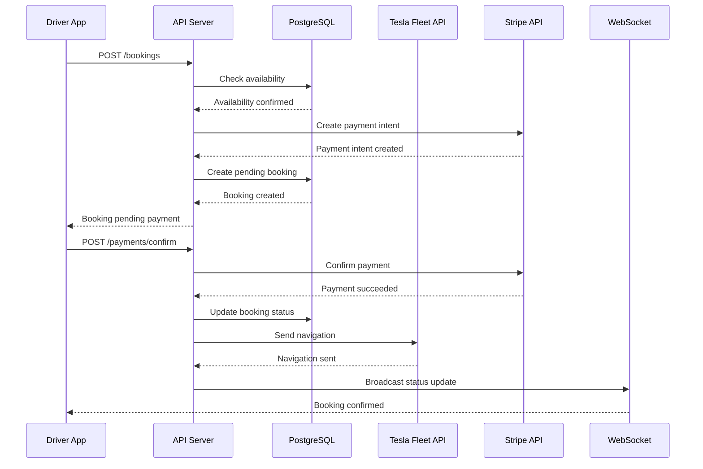
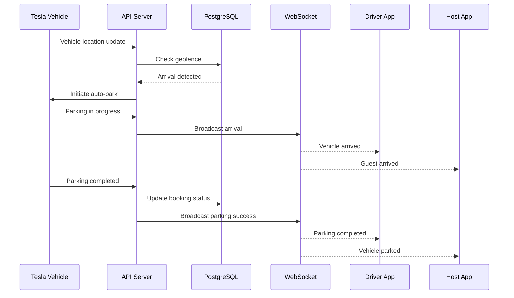

# Driveway-Hub System Architecture Overview
*Infrastructure & Deployment Strategy for Tesla-Integrated Parking Platform*

## Architecture Philosophy

Driveway-Hub is designed as a cloud-native, microservice-ready platform optimized for real-time interactions between Tesla vehicles, mobile clients, and third-party services. The architecture prioritizes reliability, scalability, and security while maintaining cost-effectiveness for MVP launch.

### Core Principles
- **Cloud-First**: AWS-native with serverless components where appropriate
- **API-Driven**: Clear separation between frontend and backend
- **Real-Time**: WebSocket connections for live updates and Tesla integration
- **Secure**: End-to-end encryption and compliance-ready architecture
- **Observable**: Comprehensive logging, monitoring, and alerting

---

## High-Level Architecture Diagram

```
┌─────────────────────────────────────────────────────────────────┐
│                        CLIENT LAYER                             │
├─────────────────────────────────────────────────────────────────┤
│ React Web App    │ React Native iOS  │ React Native Android    │
│ (Mobile-First)   │                   │                         │
└─────────────────────────────────────────────────────────────────┘
                              │
                         HTTPS/WSS
                              │
┌─────────────────────────────────────────────────────────────────┐
│                        API GATEWAY                              │
├─────────────────────────────────────────────────────────────────┤
│ AWS ALB + CloudFront │ Rate Limiting │ SSL Termination        │
│ Authentication       │ CORS          │ Request Routing        │
└─────────────────────────────────────────────────────────────────┘
                              │
┌─────────────────────────────────────────────────────────────────┐
│                     APPLICATION LAYER                           │
├─────────────────────────────────────────────────────────────────┤
│                   Node.js/Express API Server                    │
│ ┌─────────────┐ ┌─────────────┐ ┌─────────────┐ ┌─────────────┐│
│ │   Auth      │ │  Booking    │ │   Tesla     │ │  Payment    ││
│ │ Service     │ │  Service    │ │ Integration │ │  Service    ││
│ └─────────────┘ └─────────────┘ └─────────────┘ └─────────────┘│
└─────────────────────────────────────────────────────────────────┘
                              │
┌─────────────────────────────────────────────────────────────────┐
│                     INTEGRATION LAYER                           │
├─────────────────────────────────────────────────────────────────┤
│ Tesla Fleet API │ Stripe API │ Google Maps │ SendGrid │ Twilio │
└─────────────────────────────────────────────────────────────────┘
                              │
┌─────────────────────────────────────────────────────────────────┐
│                        DATA LAYER                               │
├─────────────────────────────────────────────────────────────────┤
│ PostgreSQL RDS  │ Redis Cache │ S3 Storage │ CloudWatch Logs   │
│ (Primary DB)    │ (Sessions)  │ (Images)   │ (Monitoring)      │
└─────────────────────────────────────────────────────────────────┘
```

---

## Technology Stack Breakdown

### Frontend Stack
**Web Application (React.js)**
```
├── React 18 with TypeScript
├── Tailwind CSS for styling
├── React Query for API state management
├── React Router for navigation
├── Socket.io client for real-time updates
├── Stripe Elements for payment UI
└── Google Maps JavaScript API
```

**Mobile Applications (React Native)**
```
├── React Native 0.72+
├── TypeScript for type safety
├── React Navigation for routing
├── AsyncStorage for local data
├── Push notifications (FCM/APNS)
├── Native modules for Tesla integration
└── Stripe React Native SDK
```

### Backend Stack
**API Server (Node.js/Express)**
```
├── Node.js 18+ LTS
├── Express.js framework
├── TypeScript for development
├── Socket.io for WebSocket connections
├── Passport.js for authentication
├── Joi for request validation
├── Winston for logging
└── Jest for testing
```

**Key Dependencies**
```json
{
  "express": "^4.18.0",
  "socket.io": "^4.7.0",
  "jsonwebtoken": "^9.0.0",
  "bcrypt": "^5.1.0",
  "stripe": "^12.0.0",
  "pg": "^8.11.0",
  "redis": "^4.6.0",
  "aws-sdk": "^2.1400.0",
  "joi": "^17.9.0",
  "winston": "^3.9.0"
}
```

### Database & Storage
**Primary Database: PostgreSQL 14+**
- AWS RDS with Multi-AZ deployment
- PostGIS extension for geospatial queries
- Read replicas for performance optimization
- Automated backups with 7-day retention

**Caching Layer: Redis 7+**
- AWS ElastiCache cluster
- Session storage and JWT blacklisting
- API response caching
- Real-time data caching

**File Storage: AWS S3**
- Driveway photos and profile images
- CloudFront CDN for global distribution
- Lifecycle policies for cost optimization
- Encryption at rest and in transit

---

## AWS Infrastructure Architecture

### Production Environment

```
┌─────────────────────────────────────────────────────────────────┐
│                          ROUTE 53                               │
│                     (DNS Management)                            │
└─────────────────────────────────────────────────────────────────┘
                              │
┌─────────────────────────────────────────────────────────────────┐
│                       CLOUDFRONT                                │
│                    (Global CDN)                                 │
└─────────────────────────────────────────────────────────────────┘
                              │
┌─────────────────────────────────────────────────────────────────┐
│                    APPLICATION LOAD BALANCER                    │
│                     (SSL Termination)                          │
└─────────────────────────────────────────────────────────────────┘
                              │
┌─────────────────────────────────────────────────────────────────┐
│                          VPC                                    │
│ ┌─────────────────┐ ┌─────────────────┐ ┌─────────────────┐    │
│ │  Public Subnet  │ │  Public Subnet  │ │  Public Subnet  │    │
│ │   (AZ-1a)       │ │   (AZ-1b)       │ │   (AZ-1c)       │    │
│ │                 │ │                 │ │                 │    │
│ │ ┌─────────────┐ │ │ ┌─────────────┐ │ │ ┌─────────────┐ │    │
│ │ │  ECS Task   │ │ │ │  ECS Task   │ │ │ │  ECS Task   │ │    │
│ │ │ (API Server)│ │ │ │ (API Server)│ │ │ │ (API Server)│ │    │
│ │ └─────────────┘ │ │ └─────────────┘ │ │ └─────────────┘ │    │
│ └─────────────────┘ └─────────────────┘ └─────────────────┘    │
│                                                                 │
│ ┌─────────────────┐ ┌─────────────────┐ ┌─────────────────┐    │
│ │ Private Subnet  │ │ Private Subnet  │ │ Private Subnet  │    │
│ │   (AZ-1a)       │ │   (AZ-1b)       │ │   (AZ-1c)       │    │
│ │                 │ │                 │ │                 │    │
│ │ ┌─────────────┐ │ │ ┌─────────────┐ │ │ ┌─────────────┐ │    │
│ │ │ RDS Primary │ │ │ │ RDS Standby │ │ │ │ElastiCache  │ │    │
│ │ │(PostgreSQL) │ │ │ │(Multi-AZ)   │ │ │ │  (Redis)    │ │    │
│ │ └─────────────┘ │ │ └─────────────┘ │ │ └─────────────┘ │    │
│ └─────────────────┘ └─────────────────┘ └─────────────────┘    │
└─────────────────────────────────────────────────────────────────┘
```

### Container Orchestration (ECS Fargate)

**Service Configuration:**
```yaml
api_service:
  image: driveway-hub/api:latest
  cpu: 1024      # 1 vCPU
  memory: 2048   # 2 GB RAM
  replicas: 3    # Minimum for high availability
  auto_scaling:
    min: 3
    max: 10
    target_cpu: 70%
    target_memory: 80%
  
  environment:
    NODE_ENV: production
    DATABASE_URL: ${RDS_CONNECTION_STRING}
    REDIS_URL: ${ELASTICACHE_ENDPOINT}
    JWT_SECRET: ${JWT_SECRET}
    TESLA_CLIENT_ID: ${TESLA_CLIENT_ID}
    STRIPE_SECRET_KEY: ${STRIPE_SECRET_KEY}
```

**Load Balancer Configuration:**
```yaml
load_balancer:
  type: application
  scheme: internet-facing
  listeners:
    - port: 443
      protocol: HTTPS
      ssl_policy: ELBSecurityPolicy-TLS-1-2-2017-01
      certificate: ${SSL_CERTIFICATE_ARN}
  health_check:
    path: /health
    interval: 30s
    timeout: 5s
    healthy_threshold: 2
    unhealthy_threshold: 3
```

---

## Service Architecture

### Microservice Boundaries

**Authentication Service**
```javascript
// Responsibilities:
- User registration and login
- JWT token management
- Tesla OAuth integration
- Password reset flows
- Session management

// API Endpoints:
POST /auth/register
POST /auth/login
POST /auth/logout
POST /auth/tesla/connect
POST /auth/refresh
GET  /auth/me
```

**Booking Service**
```javascript
// Responsibilities:
- Booking creation and management
- Availability checking
- Pricing calculations
- Booking status updates
- Calendar management

// API Endpoints:
POST /bookings
GET  /bookings
GET  /bookings/:id
PUT  /bookings/:id
POST /bookings/:id/cancel
GET  /bookings/:id/status
```

**Tesla Integration Service**
```javascript
// Responsibilities:
- Tesla Fleet API communication
- Vehicle status monitoring
- Auto-park coordination
- Navigation commands
- Real-time location tracking

// API Endpoints:
GET  /tesla/vehicles
GET  /tesla/vehicles/:id/status
POST /tesla/vehicles/:id/navigate
POST /tesla/vehicles/:id/autopark
GET  /tesla/vehicles/:id/location
```

**Payment Service**
```javascript
// Responsibilities:
- Stripe payment processing
- Host payout management
- Refund processing
- Financial reporting
- Fraud detection

// API Endpoints:
POST /payments/intents
POST /payments/confirm
POST /payments/refund
GET  /payments/history
POST /payouts/create
GET  /payouts/status
```

### Data Flow Architecture

**Booking Creation Flow:**


**Auto-Park Flow:**


---

## Security Architecture

### Network Security

**VPC Configuration:**
```yaml
vpc:
  cidr: 10.0.0.0/16
  
  public_subnets:
    - 10.0.1.0/24  # AZ-1a
    - 10.0.2.0/24  # AZ-1b
    - 10.0.3.0/24  # AZ-1c
  
  private_subnets:
    - 10.0.11.0/24  # AZ-1a
    - 10.0.12.0/24  # AZ-1b
    - 10.0.13.0/24  # AZ-1c

  security_groups:
    api_server:
      ingress:
        - port: 443, source: ALB
        - port: 3000, source: ALB
      egress:
        - port: 443, destination: 0.0.0.0/0
        - port: 5432, destination: RDS
        - port: 6379, destination: Redis
    
    database:
      ingress:
        - port: 5432, source: api_server_sg
      egress: []
```

### Application Security

**Authentication & Authorization:**
```javascript
// JWT Token Structure
{
  "sub": "user_uuid",
  "email": "user@example.com",
  "user_type": "driver",
  "permissions": ["booking:create", "vehicle:control"],
  "tesla_linked": true,
  "exp": 1234567890,
  "iat": 1234567890
}

// Role-Based Access Control
const permissions = {
  driver: [
    'booking:create',
    'booking:view',
    'booking:cancel',
    'vehicle:control',
    'payment:create'
  ],
  host: [
    'driveway:create',
    'driveway:manage',
    'booking:view',
    'payout:view'
  ],
  admin: ['*']
};
```

**Data Encryption:**
```javascript
// Encryption at Rest
- Database: AWS RDS encryption with KMS
- File Storage: S3 server-side encryption
- Backups: Encrypted snapshots

// Encryption in Transit
- API: TLS 1.3 with HSTS
- Database: SSL connections required
- Internal: VPC traffic encryption

// Application-Level Encryption
- Tesla tokens: AES-256 encryption
- PII data: Field-level encryption
- Passwords: bcrypt with salt rounds 12
```

### Compliance & Privacy

**Data Protection:**
```yaml
data_retention:
  user_data: indefinite (while account active)
  deleted_accounts: 90_days
  payment_records: 7_years
  audit_logs: 7_years
  location_data: 30_days

privacy_controls:
  data_export: GDPR/CCPA compliant
  data_deletion: Right to be forgotten
  consent_management: Granular permissions
  anonymization: Location data after 30 days
```

---

## Monitoring & Observability

### Application Monitoring

**Health Checks:**
```javascript
// Health Check Endpoint
GET /health
{
  "status": "healthy",
  "checks": {
    "database": "healthy",
    "redis": "healthy",
    "tesla_api": "healthy",
    "stripe_api": "healthy"
  },
  "version": "1.0.0",
  "uptime": 3600,
  "timestamp": "2025-07-10T15:30:00Z"
}
```

**Key Metrics:**
```yaml
performance_metrics:
  - api_response_time_p95
  - booking_creation_success_rate
  - tesla_api_success_rate
  - payment_success_rate
  - websocket_connection_count

business_metrics:
  - daily_active_users
  - booking_conversion_rate
  - revenue_per_booking
  - host_utilization_rate
  - driver_retention_rate
```

**Logging Strategy:**
```javascript
// Structured Logging with Winston
const logger = winston.createLogger({
  format: winston.format.combine(
    winston.format.timestamp(),
    winston.format.json()
  ),
  defaultMeta: {
    service: 'driveway-hub-api',
    version: process.env.APP_VERSION
  },
  transports: [
    new winston.transports.CloudWatchLogs({
      logGroupName: '/aws/ecs/driveway-hub',
      logStreamName: 'api-server'
    })
  ]
});

// Log Levels and Categories
- ERROR: System errors, payment failures, Tesla API errors
- WARN: Rate limit hits, validation failures
- INFO: Booking events, user actions, API calls
- DEBUG: Detailed request/response data
```

### Alerting Configuration

**Critical Alerts:**
```yaml
alerts:
  high_priority:
    - api_error_rate > 5%
    - database_connection_failure
    - payment_processing_failure
    - tesla_api_unavailable
    - security_breach_detected
  
  medium_priority:
    - api_response_time > 2s
    - booking_failure_rate > 2%
    - websocket_disconnection_spike
    - disk_usage > 80%
  
  low_priority:
    - cache_miss_rate > 20%
    - user_registration_drop
    - email_delivery_failure
```

---

## Deployment & CI/CD

### Development Workflow

**Branch Strategy:**
```
main (production)
├── staging (pre-production testing)
├── develop (integration branch)
└── feature/* (individual features)
```

**CI/CD Pipeline:**
```yaml
pipeline:
  stages:
    - test
    - build
    - security_scan
    - deploy_staging
    - integration_tests
    - deploy_production

  test:
    - unit_tests (Jest)
    - integration_tests (Supertest)
    - typescript_compilation
    - linting (ESLint)
    - code_coverage (>80%)

  build:
    - docker_build
    - image_optimization
    - vulnerability_scanning
    - push_to_ecr

  deploy:
    staging:
      - terraform_plan
      - terraform_apply
      - health_check_validation
      - smoke_tests
    
    production:
      - manual_approval_required
      - blue_green_deployment
      - canary_deployment (10%)
      - full_rollout_after_validation
```

### Environment Configuration

**Development Environment:**
```yaml
development:
  database: local_postgresql
  cache: local_redis
  storage: local_filesystem
  external_apis: sandbox_mode
  logging: console_output
  hot_reload: enabled
```

**Staging Environment:**
```yaml
staging:
  database: rds_single_az
  cache: elasticache_single_node
  storage: s3_bucket
  external_apis: sandbox_mode
  logging: cloudwatch
  ssl: letsencrypt
  domain: api-staging.driveway-hub.app
```

**Production Environment:**
```yaml
production:
  database: rds_multi_az
  cache: elasticache_cluster
  storage: s3_with_cloudfront
  external_apis: production_mode
  logging: cloudwatch_with_retention
  ssl: aws_certificate_manager
  domain: api.driveway-hub.app
  monitoring: full_observability_stack
```

---

## Scalability & Performance

### Auto-Scaling Configuration

**Horizontal Scaling:**
```yaml
ecs_service:
  min_capacity: 3
  max_capacity: 20
  target_cpu_utilization: 70%
  target_memory_utilization: 80%
  scale_up_cooldown: 300s
  scale_down_cooldown: 600s

database:
  read_replicas: 2
  auto_scaling_read_replicas: true
  max_read_replicas: 5
  connection_pooling: enabled
```

**Performance Optimizations:**
```javascript
// Database Optimizations
- Connection pooling (pg-pool)
- Query optimization with EXPLAIN
- Proper indexing strategy
- Read replica for analytics queries

// Caching Strategy
- API response caching (Redis)
- Static asset caching (CloudFront)
- Database query result caching
- Session storage optimization

// API Optimizations
- Compression middleware (gzip)
- Request/response size limits
- Pagination for large datasets
- GraphQL for efficient data fetching
```

### Disaster Recovery

**Backup Strategy:**
```yaml
database_backups:
  automated_backups: enabled
  backup_retention: 7_days
  backup_window: "03:00-04:00 UTC"
  point_in_time_recovery: enabled
  cross_region_backups: enabled

application_backups:
  code_repository: github_with_redundancy
  container_images: ecr_multi_region
  configuration: parameter_store_backups
  ssl_certificates: acm_automatic_renewal
```

**Recovery Procedures:**
```yaml
rto_targets:  # Recovery Time Objective
  critical_services: 15_minutes
  full_platform: 1_hour
  data_restore: 4_hours

rpo_targets:  # Recovery Point Objective
  transaction_data: 1_minute
  user_data: 15_minutes
  analytics_data: 1_hour
```

---

## Cost Optimization

### Resource Allocation

**MVP Infrastructure Costs (Monthly):**
```yaml
compute:
  ecs_fargate: $150
  load_balancer: $25
  total: $175

storage:
  rds_postgresql: $120
  elasticache_redis: $80
  s3_storage: $20
  total: $220

networking:
  cloudfront_cdn: $15
  data_transfer: $30
  total: $45

monitoring:
  cloudwatch: $25
  total: $25

estimated_monthly_total: $465
```

**Cost Optimization Strategies:**
```yaml
immediate:
  - use_spot_instances_for_non_critical_workloads
  - implement_s3_lifecycle_policies
  - optimize_cloudwatch_log_retention
  - use_reserved_instances_for_stable_workloads

scaling:
  - implement_auto_scaling_aggressive_policies
  - use_lambda_for_infrequent_operations
  - optimize_database_instance_sizes
  - implement_cache_warming_strategies
```

---

## Future Architecture Considerations

### Microservices Evolution

**Phase 2 (Post-MVP):**
```
Current Monolith → Service Decomposition
├── User Service (Authentication & Profiles)
├── Driveway Service (Listings & Availability)
├── Booking Service (Reservations & Calendar)
├── Payment Service (Transactions & Payouts)
├── Tesla Service (Vehicle Integration)
├── Notification Service (Email & Push)
└── Analytics Service (Reporting & Insights)
```

**Technology Evolution:**
```yaml
current_stack:
  - node_js_express_monolith
  - postgresql_single_instance
  - basic_monitoring

future_stack:
  - kubernetes_orchestration
  - event_driven_architecture
  - microservices_communication
  - advanced_observability
  - machine_learning_integration
```

### Multi-Region Expansion

**Geographic Scaling:**
```yaml
current: us_west_2_single_region
expansion_plan:
  phase_1: us_east_1 (East Coast)
  phase_2: eu_west_1 (Europe)
  phase_3: ap_southeast_1 (Asia)

considerations:
  - data_residency_compliance
  - latency_optimization
  - regulatory_requirements
  - cost_management
```

---

*This system architecture provides a comprehensive foundation for Driveway-Hub's MVP while maintaining flexibility for future growth and scaling requirements.*
